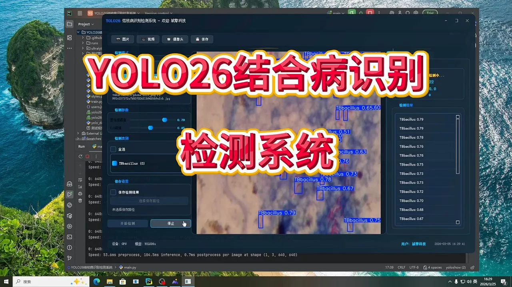
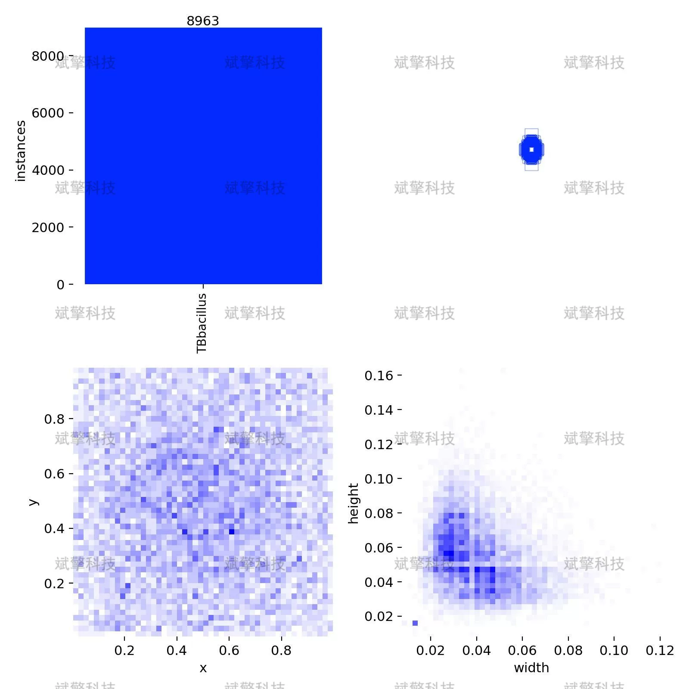
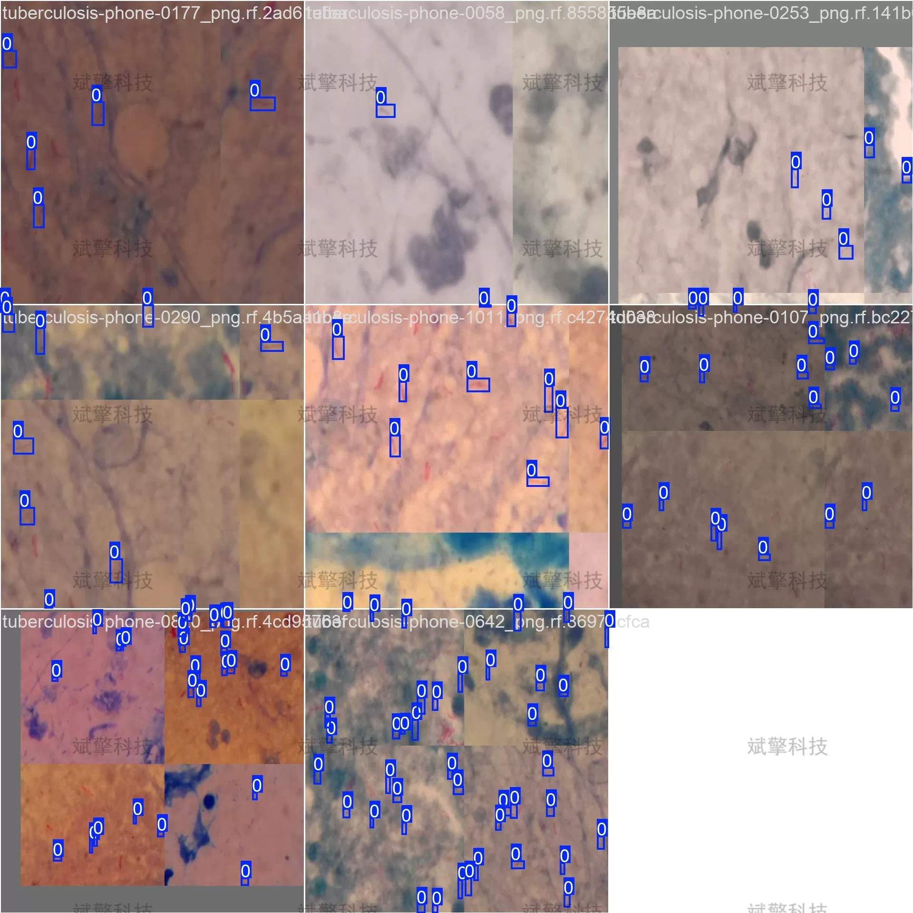
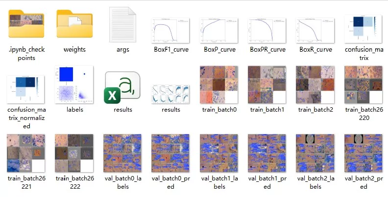
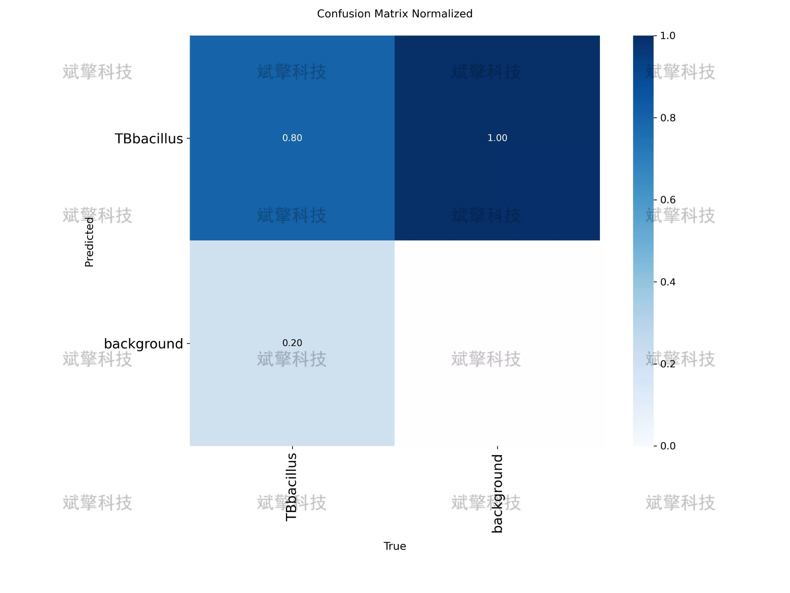
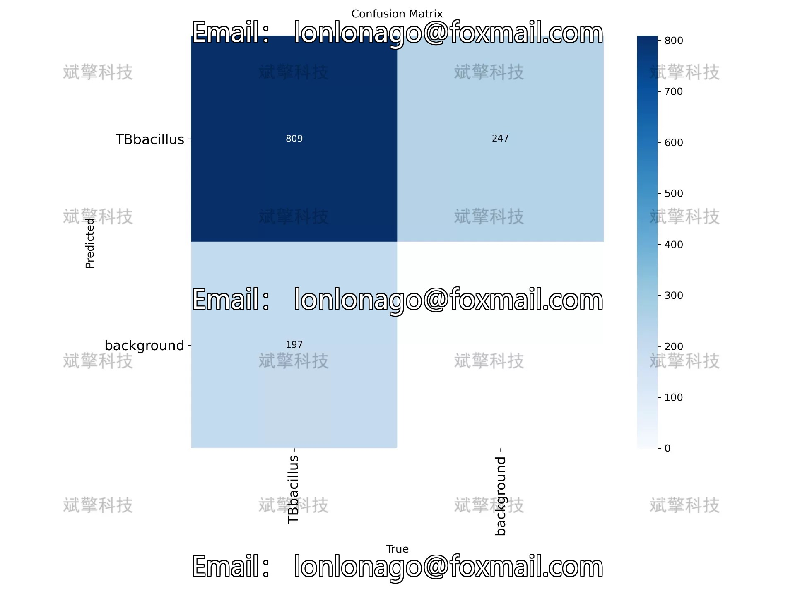
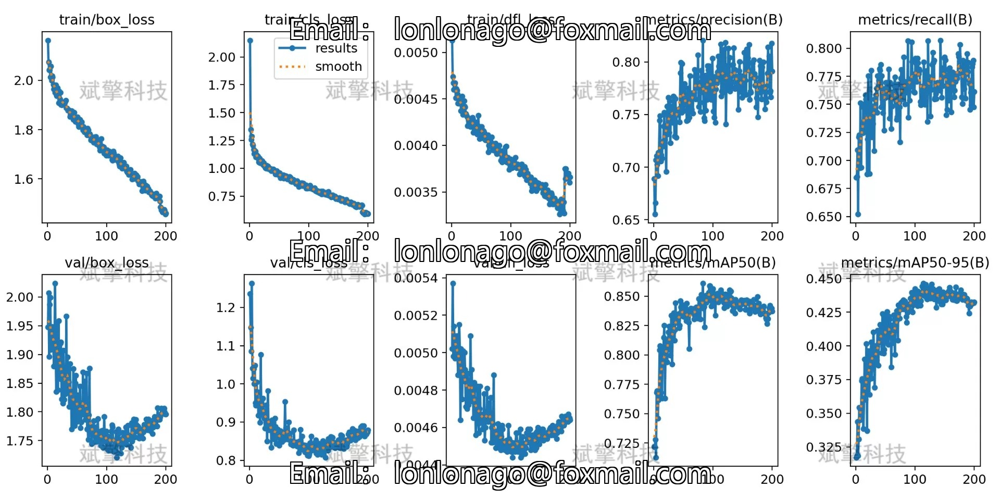
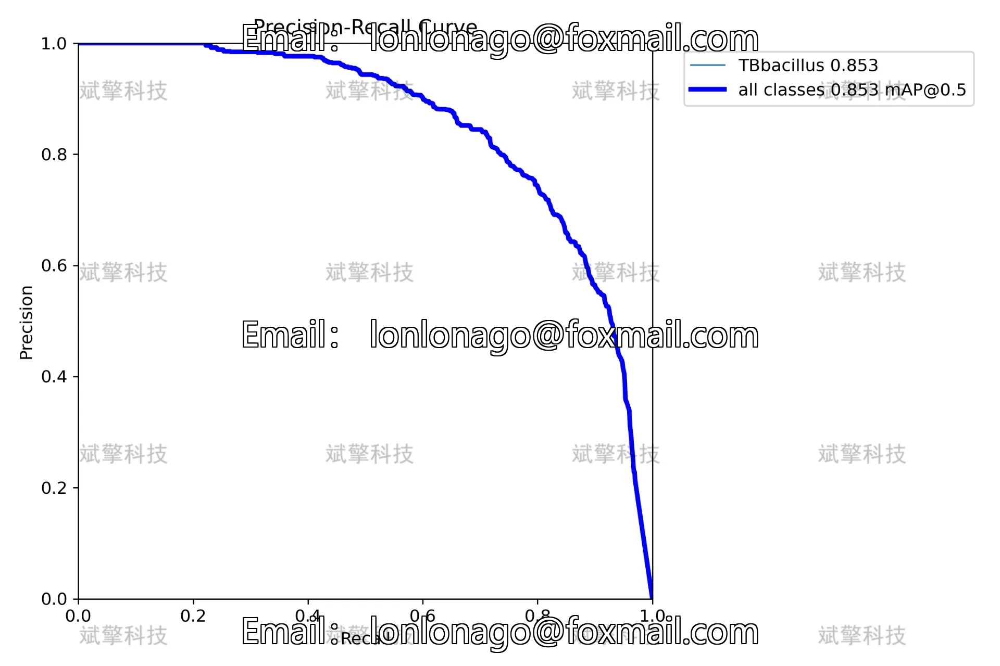
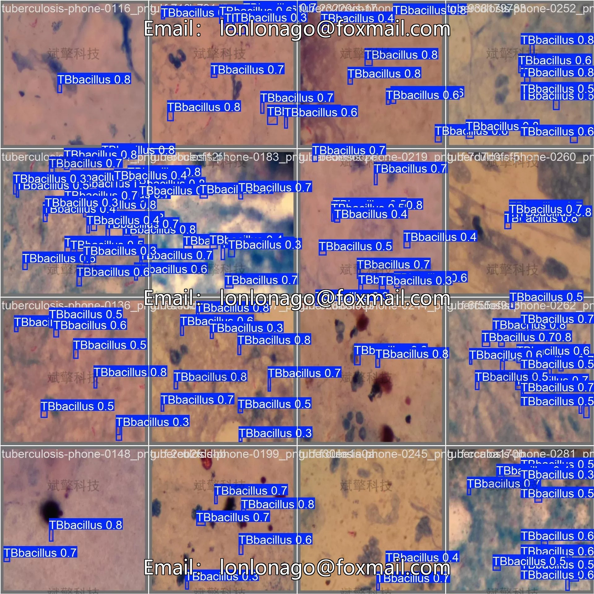

# YOLOv26 Tuberculosis Identification and Detection System | Model

## Body

YOLO26 Tuberculosis Detection System | Model YOLO26 Tuberculosis Detection System: Transfer Learning and Performance Evaluation of the YOLO26 Tuberculosis Detection System (Project Source Code + Dataset + Model Weights + UI Interface + Python + Deep Learning + Remote Environment Deployment)

Tuberculosis is a serious infectious disease caused by Mycobacterium tuberculosis. Globally, there are still many new cases and deaths annually. Traditional diagnosis of tuberculosis mainly relies on smear microscopy, which is time-consuming, has low sensitivity, and highly depends on the experience of the examiner. To address this issue, this study proposes an automatic detection system for Mycobacterium tuberculosis based on YOLO26. The system targets a single category (TBbacillus) and uses a training set containing 1098 labeled images, with 122 in the validation set. The experimental results show that the model achieves an average precision mean (mAP@0.5) of 0.853 under IoU=0.5, with a best F1 score of 0.77 (confidence threshold 0.279), and can achieve 1.00 accuracy at high confidence levels. The confusion matrix analysis shows that the model has a detection rate of 80% for Mycobacterium tuberculosis and a false positive rate of 20%. This study provides a feasible technical solution for the automation of microscopic screening for tuberculosis, which helps to improve the efficiency and accuracy of diagnosis.

Dataset Size
Number of categories: 1 class
Category name: ['TBbacillus'] (Mycobacterium tuberculosis)
Training set: 1098 images
Validation set: 122 images
Total sample size: 1220 labeled images

Free appointment for remote installation. Unsuccessful full refund.
Purchase Enjoy the following resources (Baidu Pan download unlocked automatically)
   - Complete source code of YOLO recognition detection project
   - YOLO format dataset
   - Training code + UI interface code
   - Trained model + result images
   - Software installer package
   - Add WeChat appointment for remote installation (Automatically display WeChat ID after purchase) - Unsuccessful, full refund

⚙️ Core Functional Modules
Detection Capability
    Image detection: upload and check immediately, return detection box + category information
    Video detection: supports video files, analyzes frames accurately
    Camera real-time detection: connects USB camera, realizes dynamic monitoring
Interaction and Control
    Target selection: freely choose one or more categories for detection
    Parameter adjustment: adjustable confidence threshold & IoU threshold, flexibly control accuracy
    Result saving: save image/video/camera detection results in one click
System and Data
    User login registration: Support password strength detection + encryption storage
    Log recording: automatically records operation and error information (timestamped)

## Images

## Payment

Here is a pay link on Stripe ( https://buy.stripe.com/3cs8yP7sY87d0vu9AB ). Please contact me lonlonago@foxmail.com after funding $89, and I will send you a complete data files , thank you!

